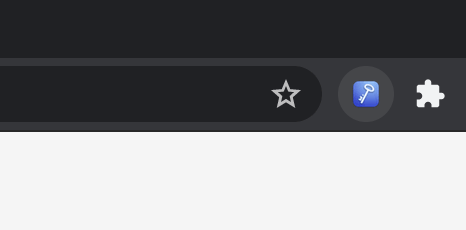

# KeeWeb Connect: browser extension


This is a browser extension for [KeeWeb](https://keeweb.info).
Although KeeWeb supports auto-typing, browser extensions provide seamless integration
consistent across all operating systems.




## Status

WIP, not ready to use yet. For now, while the extension is in active development,
it's recommended to install it manually from GitHub releases:
https://github.com/keeweb/keeweb-connect/releases/latest

If you would like to give it a test, you can also install it from stores (but please keep in mind 
that it's an outdated development version, they will be updated before the final release):
- [Chrome](https://chrome.google.com/webstore/detail/keeweb-connect/pikpfmjfkekaeinceagbebpfkmkdlcjk)
- [Firefox](https://addons.mozilla.org/firefox/addon/keeweb-connect/)
- [Edge](https://microsoftedge.microsoft.com/addons/detail/keewebconnect/nmggpehkjmeaeocmaijenpejbepckinm)
- Safari: (in progress, install [from GitHub releases](https://github.com/keeweb/keeweb-connect/releases/latest))
- Other browsers: [how to set up](https://github.com/keeweb/keeweb/wiki/Browser-AutoFill#other-browsers)

## Translations

If you would like to translate the extension, it's already waiting for you on OneSky: https://keeweb.oneskyapp.com/collaboration/project?id=382232

## Building

The project is built with `npm`:

Production build:
```sh
npm start
```

Build a development version and watch:
```sh
npm run watch
```

## Versioning

This repository has tags consisting of three numbers, for example,
`0.1.0`, `0.1.1`, `0.1.2`, and so on. However, browser add-ons are versioned with
two digits like `0.1`. The convention used here is that the "minor" (middle number)
digit is incremented when there's a new add-on version, and otherwise it's 
some other update: native messaging host, documentation, etc...

Example:

- git tag: `0.1.0`
  - browser extension: `0.1`
  - native messaging host: `0.1.0`
- git tag: `0.1.1`
  - browser extension: `-`
  - native messaging host: `0.1.1`
- git tag: `0.1.2`
  - browser extension: `-`
  - native messaging host: `0.1.2`
- git tag: `0.2.0`
  - browser extension: `0.2`
  - native messaging host: `0.2.0`

If you have a browser extension with version `0.1`, its exact source code
can be found under `0.1.0` git tag.

## Protocol

KeeWeb implements [keepassxc-protocol](https://github.com/keepassxreboot/keepassxc-browser/blob/develop/keepassxc-protocol.md)
with several modifications for KeeWeb listed [here](docs/keeweb-connect-protocol.md).

## License

[MIT](https://github.com/keeweb/keeweb-connect/blob/master/LICENSE)

